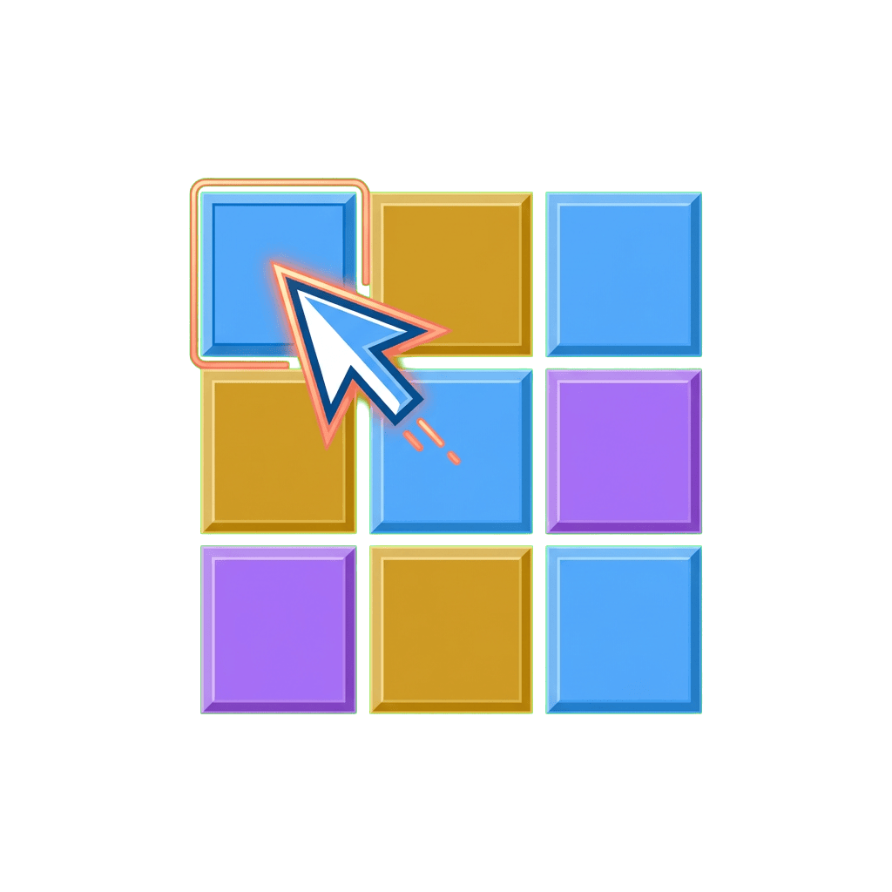

<div align="center">
  

# aerospace-setup

[](https://github.com/tsilva/aerospace-setup/blob/main/LICENSE)
[](https://github.com/nikitabobko/AeroSpace)
[](https://github.com/tsilva/aerospace-setup/tree/main/scripts)

**🚀 Portable Aerospace configuration with Cursor project switching via Alfred**

[Installation](#-installation) · [Features](#-features) · [Configuration](#%EF%B8%8F-configuration)

</div>

---

## ✨ Features

- **One-command setup** - Install all Aerospace configs, scripts, and Alfred workflow
- **Cursor window management** - Organize Cursor projects into numbered workspaces with `alt+s`
- **Alfred integration** - Browse all repos and switch or open projects with `alt+p`, capture ideas with `alt+shift+c`
- **Project priorities** - Define which projects get lower workspace numbers
- **Cross-platform paths** - Auto-detects Homebrew location (Apple Silicon or Intel)
- **Notification integration** - Provides click-to-focus for [claude-code-notify](https://github.com/tsilva/claude-code-notify)

## 📦 Installation

### Prerequisites

```bash
# Install Aerospace (tiling window manager)
brew install nikitabobko/tap/aerospace

# Alfred 5 required for project switcher workflow
```

### Quick Install

```bash
git clone https://github.com/tsilva/aerospace-setup.git
cd aerospace-setup
./install.sh
```

The installer will:
1. Check for Aerospace and Alfred
2. Copy `aerospace.toml` to `~/.aerospace.toml`
3. Install helper scripts to `~/.config/aerospace/`
4. Create symlink `~/.claude/focus-window.sh` for notification integration
5. Set up Alfred workflows for project switching and idea capture
6. Reload Aerospace configuration

## ⌨️ Keybindings

| Keybinding | Action |
|------------|--------|
| `alt+1-9` | Switch to workspace 1-9 |
| `alt+shift+1-9` | Move window to workspace 1-9 |
| `alt+←/→` | Previous/next workspace |
| `alt+s` | Organize Cursor windows by priority |
| `alt+p` | Open Alfred project switcher (`p` keyword) |
| `alt+c` | Open Alfred idea capture (`c` keyword) |
| `alt+f` | Toggle fullscreen |

## 🗂️ Project Structure

```
aerospace-setup/
├── install.sh                    # Main installer
├── uninstall.sh                  # Cleanup script
├── config/
│   ├── aerospace.toml            # Aerospace configuration
│   └── cursor-projects.txt.example  # Project priority template
├── scripts/
│   ├── aerospace-fix-cursor.sh   # Organize Cursor windows
│   ├── list-all-repos.sh         # Alfred script filter (all repos)
│   ├── list-cursor-windows.sh    # List open Cursor windows
│   ├── focus-window.sh           # Focus or open project (Alfred)
│   └── notification-focus-window.sh  # Focus window by workspace name (notifications)
└── alfred/
    ├── cursor-project-switcher/
    │   └── info.plist            # Alfred project switcher workflow
    └── quick-idea-capture/
        └── info.plist            # Alfred idea capture workflow
```

## ⚙️ Configuration

### Project Priorities

Edit `~/.config/aerospace/cursor-projects.txt` to set your project priority order:

```
my-main-project
side-project
experiments
```

Projects listed first get lower workspace numbers (starting at workspace 2). Projects not listed are assigned to subsequent workspaces alphabetically.

### Window Auto-Assignment

Apps are automatically moved to workspace 1:
- Chrome, Obsidian, ChatGPT, Claude, Sublime Text, WhatsApp

Edit `~/.aerospace.toml` to customize.

## 🔔 Claude Code Notification Integration

This setup provides window-focusing support for [claude-code-notify](https://github.com/tsilva/claude-code-notify), enabling click-to-focus from desktop notifications.

The installer creates a symlink:
```
~/.claude/focus-window.sh → ~/.config/aerospace/notification-focus-window.sh
```

When you click a Claude Code notification, it uses this symlink to:
1. Find the Cursor/VS Code window matching the workspace name
2. Switch to that window's AeroSpace workspace
3. Focus the window

This works reliably on macOS Sequoia where traditional AppleScript/Hammerspoon APIs fail.

## 🗑️ Uninstall

```bash
./uninstall.sh
```

Removes all installed files. Aerospace itself is not uninstalled.

## 📄 License

MIT
